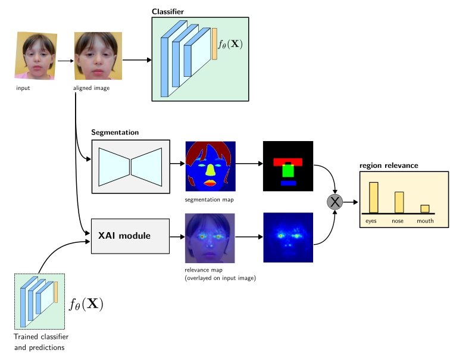

#  Region-based Saliency Explanations on the Recognition of Facial Genetic Syndromes (```facial-gestalt-xai```)



This repository contains official implementation of our MLHC'23 paper.

> Ömer Sümer, Rebekah L. Waikel, Suzanna E. Ledgister Hanchard, Dat Duong, Cristina Conati, Peter Krawitz, Benjamin D. Solomon, and Elisabeth André, "Region-based Saliency Explanations on the Recognition of Facial Genetic Syndromes," Machine Learning for Healthcare, 2023.

You can access the metadata files to reproduce the database used in this study:
NIH Facial Genetic Syndromes Database [(Zenodo dataset link)]([http://doi.org/10.5281/zenodo.8113907](https://doi.org/10.5281/zenodo.8113906))

## Environment

All required Python packages are listed in the ```environment.yml``` file. Create and activate Python environment

```
conda env create --name facial-gestalt-xai --file environment.yml
conda activate facial-gestalt-xai
``` 
Tested in Ubuntu 22.04 OS using Python 3.9.16 in a Conda environment.

## Training Baseline DNN

We used VGG Face-2 pretrained ResNet weights for initialization and ResNet-50 architecture [(link)](https://github.com/cydonia999/VGGFace2-pytorch)

Reference paper:  
ZQ. Cao, L. Shen, W. Xie, O. M. Parkhi, A. Zisserman, VGGFace2: A dataset for recognising faces across pose and age, 2018. [(link)](https://www.robots.ox.ac.uk/~vgg/publications/2018/Cao18/cao18.pdf)

* Download VGGFace2 pretrained ResNet50 weights to the following directory: ```/models/weights/resnet50_ft_weight.pkl```  
   **Repository:** https://github.com/cydonia999/VGGFace2-pytorch \
   **G-Drive download link:** https://drive.google.com/file/d/1A94PAAnwk6L7hXdBXLFosB_s0SzEhAFU/view

* Train baseline model on recognizing facial genetic syndromes (NIH-Faces dataset)
   ```
   python train.py --dataset_folder $DATASET_ROOT --fold fold-1
   ```

* After training all 5 folds, evaluate accuracy and F1-scores of these models:
   ```
   python test.py --dataset_folder $DATASET_ROOT
   ```

## Region-based Explanations

1. Running face parts segmentation (face parser), extract pixelwise prediction of regions and save each of them as *.png images.
   ```
   `python face_utils.py --image_folder $IMAGE_FOLDER --output_folder $IMAGE_FOLDER/features/segmaps
   ```

2. Extract region-based saliency coefficients of all dataset:
   ```
   python extract_region_coefficients.py --dataset_folder $DATASET_ROOT
   ```
   This takes a bit longer, because here we use different saleincy maps to calculate region coefficents and some saliceny maps are slower (i.e., occlusion-based method)

3. Research Questions:

   * RQ1: Do Region-based saliency explanations distinguish unaffected and syndromic images?
     
     We performed statistical testing between the region-based saliency coefficients of all unaffected and sydromic groups.
     You can find it under /notebook/nb-03-RQ1.ipynb

   * RQ2: Do region-based explanations align with HPO terms labeled by clinicians?

     This research question is answered by a correlation analysis using only 171 images whose prominent HPO terms are labeled by clinicians. These images are excluded from cross-validation (any folds on previously trained models). Thus, this notebook extracts the coefficients of these 171 from scratch using all 5 models and report mean/std of correlation values. Thus, it might take some time.

 


